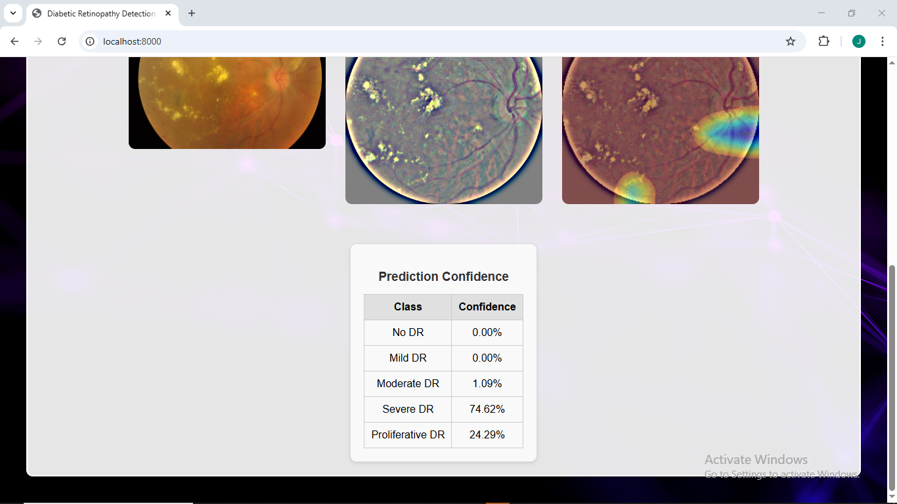

# Diabetic Retinopathy Detection System

A Django web application that uses deep learning to detect and classify diabetic retinopathy from retinal images. The system employs a ResNet-50 model to classify retinal images into different severity levels of diabetic retinopathy and provides visual explanations using Grad-CAM (Gradient-weighted Class Activation Mapping).

## 🎯 Features

- **AI-Powered Diagnosis**: Uses a trained ResNet-50 model to classify diabetic retinopathy severity
- **Interactive Web Interface**: User-friendly drag-and-drop interface for image upload
- **Image Preprocessing**: Automatic image preprocessing with circle cropping and enhancement
- **Visual Explanations**: Grad-CAM visualization showing which areas the model focuses on
- **Confidence Scores**: Displays prediction confidence for all classes
- **Real-time Results**: Instant diagnosis with visual feedback

## 📋 Classification Categories

The system classifies retinal images into 5 categories:
- **No DR**: No Diabetic Retinopathy
- **Mild DR**: Mild Diabetic Retinopathy
- **Moderate DR**: Moderate Diabetic Retinopathy  
- **Severe DR**: Severe Diabetic Retinopathy
- **Proliferative DR**: Proliferative Diabetic Retinopathy

## 🚀 Demo

### Interface
### upload/drag-and-drop fundus image

## prediction confidence


### Results Display
The system shows:
1. **Original uploaded image**
2. **Preprocessed image** (circle-cropped and enhanced)
3. **Grad-CAM visualization** (highlighting areas the model focuses on)
4. **Prediction confidence** for each class

## 🛠️ Technologies Used

- **Backend**: Django 4.x
- **Deep Learning**: TensorFlow/Keras
- **Computer Vision**: OpenCV
- **Frontend**: HTML, CSS, JavaScript
- **Model**: ResNet-50 architecture
- **Visualization**: Grad-CAM for explainable AI

## 📁 Project Structure

```
DR-Detection/
├── detector/
│   ├── model/
│   │   └── dr_resnet50_model.h5    # Trained model
│   ├── templates/
│   │   └── detector/
│   │       └── index.html          # Main interface
│   ├── views.py                    # Main application logic
│   ├── forms.py                    # Upload form
│   └── urls.py                     # URL routing
├── static/
│   └── img/                        # Static images
├── media/                          # Uploaded and processed images
├── DRDetector/
│   ├── settings.py                 # Django settings
│   └── urls.py                     # Main URL configuration
└── manage.py                       # Django management
```

## 🔧 Installation & Setup

### Prerequisites
- Python 3.8+
- pip package manager

### Step 1: Clone the repository
```bash
git clone https://github.com/yourusername/DR-Detection.git
cd DR-Detection
```

### Step 2: Create virtual environment
```bash
python -m venv venv
source venv/bin/activate  # On Windows: venv\Scripts\activate
```

### Step 3: Install dependencies
```bash
pip install django
pip install tensorflow
pip install opencv-python
pip install numpy
pip install pillow
```

### Step 4: Database setup
```bash
python manage.py migrate
```

### Step 5: Run the application
```bash
python manage.py runserver
```

Visit `http://localhost:8000` in your browser.

## 📊 Model Details

### Architecture
- **Base Model**: ResNet-50
- **Input Size**: 224x224 pixels
- **Classes**: 5 (No DR, Mild DR, Moderate DR, Severe DR, Proliferative DR)
- **Framework**: TensorFlow/Keras

### Preprocessing Pipeline
1. **Circle Cropping**: Removes black borders and focuses on the retinal area
2. **Gaussian Blur Enhancement**: Improves image quality using addWeighted technique
3. **Normalization**: Scales pixel values to [0,1] range
4. **Resizing**: Standardizes input to 224x224 pixels

### Grad-CAM Visualization
- Generates heatmaps showing which regions influenced the model's decision
- Helps medical professionals understand the AI's reasoning
- Uses the last convolutional layer (`conv5_block3_out`) for visualization

## 🖥️ Usage

1. **Access the web interface** at `http://localhost:8000`
2. **Upload an image** by:
   - Dragging and dropping a retinal image
   - Clicking "Choose retinal image" to select a file
3. **Click "Diagnose"** to process the image
4. **View results** including:
   - Diagnosis classification
   - Confidence scores for all classes
   - Original, preprocessed, and Grad-CAM images

## 🔒 Important Notes

- This system is for **educational and research purposes only**
- **Not intended for clinical diagnosis**
- Always consult qualified medical professionals for actual diagnosis
- The model's accuracy depends on image quality and training data

## 📈 Future Enhancements

- [ ] Add batch processing for multiple images
- [ ] Implement user authentication and history
- [ ] Add export functionality for reports
- [ ] Integrate with medical databases
- [ ] Improve model accuracy with more training data
- [ ] Add mobile-responsive design

## 🤝 Contributing

1. Fork the repository
2. Create a feature branch (`git checkout -b feature/AmazingFeature`)
3. Commit your changes (`git commit -m 'Add some AmazingFeature'`)
4. Push to the branch (`git push origin feature/AmazingFeature`)
5. Open a Pull Request

## 📝 License

This project is licensed under the MIT License - see the [LICENSE](LICENSE) file for details.

## 👨‍💻 Author

**Muhammad** - [GitHub Profile](https://github.com/Muhammad0isah)

## 🙏 Acknowledgments

- ResNet-50 architecture by Microsoft Research
- Grad-CAM implementation for explainable AI
- Django framework for web development
- OpenCV for image processing
- TensorFlow/Keras for deep learning

## 📞 Support

If you have any questions or issues, please feel free to:
- Open an issue on GitHub
- Contact me at: muhammadibrahimisah0@gmail.com

---

⭐ If you found this project helpful, please give it a star!
